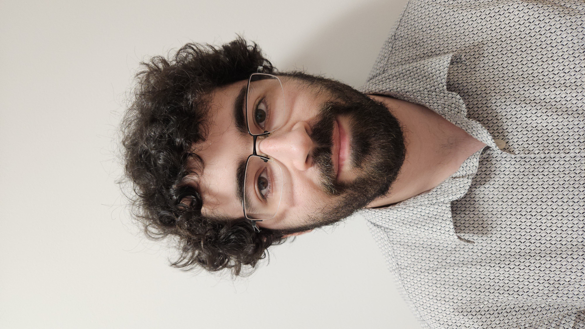

Alec Critten (he/him) is a PhD student at <a href="https://swansea.ac.uk">Swansea University</a> (Swansea, Wales, UK), specialising in formal methods applied to safety-critical systems; his PhD project (supervised by <a href="https://www.swansea.ac.uk/staff/m.seisenberger/">Monika Seisenberger</a> and <a href="https://csetzer.github.io/">Anton Setzer</a>) focuses on applications of SMT solving to the railway industry. He is a member of the Swansea Centre for Research in Digital Railways as well as the <a href="https://www.swansea.ac.uk/compsci/research-and-impact/theoretical-computer-science/">Theoretical Computer Science research group</a> at Swansea, and also serves as a Graduate Teaching Assistant (GTA) in the Department.

<figure>
  
  <figcaption>
  </figcaption>
</figure>
